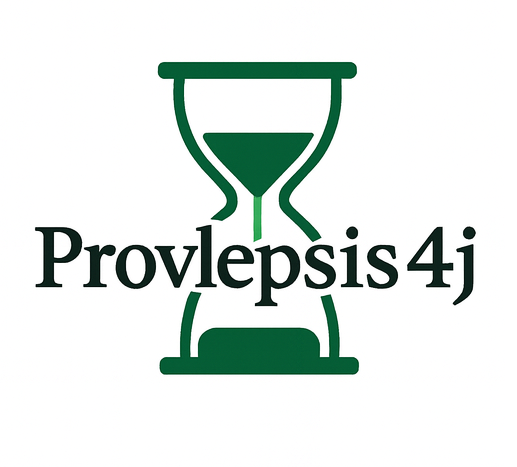
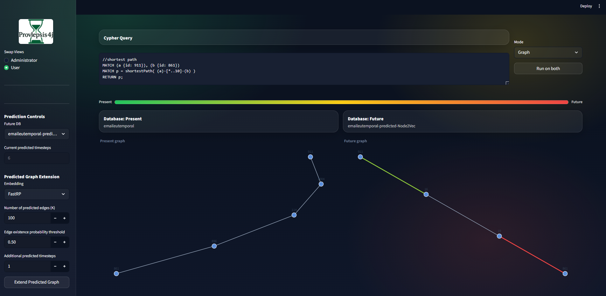
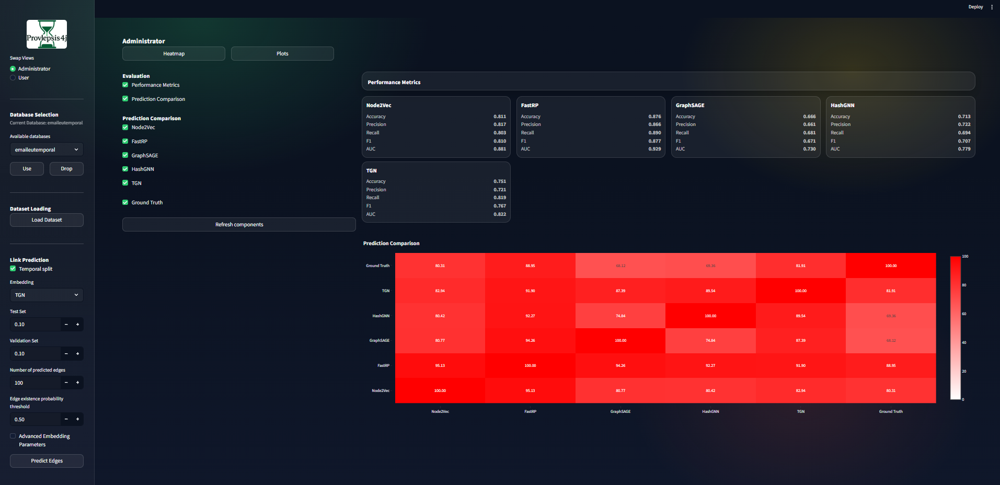
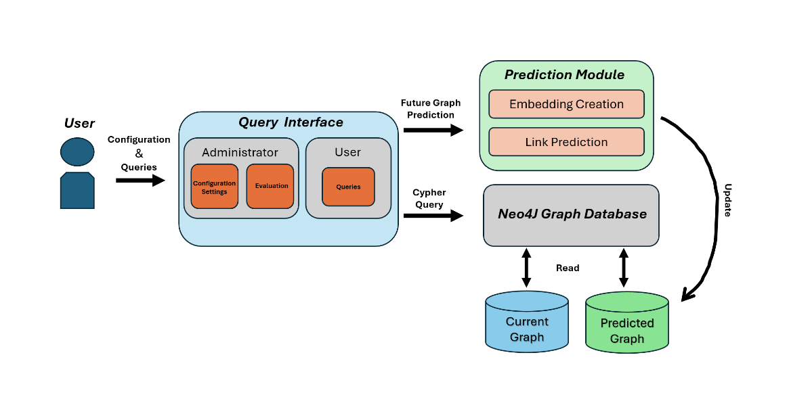

<div align="center">
  

  # Provlepsis4j

  **Query both the current graph and a predicted future graph in Neo4j using the same Cypher queries.**  
  Compare results **side by side** and **repeat prediction rounds** to extend the predicted graph further into the future.

  <!-- <a href="paper/Provlepsis4j_EDBT_demo.pdf">Demo paper (PDF)</a> · -->
  <a href="#quickstart">Quickstart</a> ·
  <a href="#workflow">Workflow</a> ·
  <a href="#cypher-examples">Cypher examples</a>

  
  
  
  
  
  
  [](https://doi.org/10.5281/zenodo.17939763)

</div>

---

## What is Provlepsis4j?

Provlepsis4j is a web system that enables querying both the **current** graph and a **predicted future** graph in Neo4j using the same Cypher queries.

Graph databases such as Neo4j typically query only the current graph, while link-prediction pipelines are executed as separate workflows that output lists of candidate edges. This makes it difficult to combine prediction and querying, and to compare current and predicted graph states within the same environment.

Provlepsis4j addresses this by connecting to a Neo4j instance and maintaining:

- a **current** Neo4j database (the observed graph), and
- a **predicted** Neo4j database (same node set, plus predicted relationships),

and executing each Cypher query on both so differences are explicit. Users can also extend the predicted future graph over multiple rounds and inspect how answers change as predicted edges are added.

<p align="center">
  
</p>

### Two views

- **Administrator view**: configure Neo4j, load datasets, split train/validation/test, run embeddings and prediction, report evaluation metrics, and compare prediction sets across embedding methods.
- **User view**: write a Cypher query once and see answers on both graphs side by side (table + interactive visualization), including predicted edges annotated by prediction round.

<p align="center">
  
</p>

---

## System overview

<p align="center">
  
</p>

At a high level:

1. **Storage**: Provlepsis4j uses Neo4j as the backend and stores the **current** and **predicted** graphs as separate Neo4j databases that share the same node set.
2. **Prediction module** (configurable):
   - computes **node embeddings** using attribute-agnostic, attribute-aware, and temporal methods (e.g., Node2Vec, FastRP, GraphSAGE, HashGNN, TGN),
   - forms **edge-level features** from the embeddings of the two endpoints using the **Hadamard product**,
   - trains a **logistic regression** model to estimate edge existence probability,
   - materializes up to `k` predicted edges whose probability is at least `threshold` into the **predicted** database, storing the edge probability and a discrete timestamp / prediction round.
3. **Querying**: the interface executes the **same Cypher query** on both databases and presents results side by side, making differences explicit.
4. **Multiple future timesteps**: repeating prediction rounds adds new predicted edges with updated prediction round and timestamp, extending the predicted graph further into the future.

---

## Quickstart

### Prerequisites (Neo4j)

You need a Neo4j instance that Provlepsis4j can connect to and use for both **current** and **predicted** graphs.

**Required:**
- **Python 3.11+**
- **Neo4j 5.x**
- **Graph Data Science (GDS)** plugin
- **APOC** plugin
- A Neo4j user with sufficient privileges to run procedures and create/use **separate predicted databases**

**Optional:**
- **PyTorch** and **PyTorch Geometric** if you want to use **TGN**

### Install dependencies

```bash
pip install -r requirements.txt
```

### Run the interface

```bash
streamlit run app.py
```

### Optional: run the FastAPI backend separately

```bash
uvicorn provlepsis_core.main_fastapi:app --reload --port 8080
```

Then, in the UI:
1. Open **Configuration** and set your Neo4j connection (URI / user / password / database).
2. Load a dataset (CSV edge list + optional node features) or connect to an existing Neo4j database.
3. Create the train/validation/test split.
4. Compute embeddings, run prediction, and start querying (current vs predicted).

---

## Workflow

Provlepsis4j supports querying both the **current** graph and a **predicted future** graph in Neo4j. Starting from the current graph, the system generates predicted edges using a configurable prediction pipeline and materializes them in a separate Neo4j database. Users can then issue the same Cypher query on both databases and inspect how the answers change when predicted edges are included. The process can be repeated over multiple rounds, producing predicted graphs that extend further into the future.

This is the workflow the demo is designed around: **predict → query → compare → iterate**.

### 1) Configure Neo4j

Provlepsis4j runs on top of a Neo4j instance:

- In the **Configuration** panel, set the connection details (URI, credentials, database) so the backend can execute Cypher and GDS procedures on your Neo4j deployment.

### 2) Load a graph

Neo4j serves as the storage backend for both the current and the predicted future graphs:

- Through the Provlepsis4j interface, users can **import a dataset from CSV files** to create the current graph, or work with an existing Neo4j database.
- Once the data are imported, the resulting database is considered the **current graph** and acts as input to the prediction module.

### 3) Split into train / validation / test

Provlepsis4j splits the graph into training and evaluation data:

- The administrator specifies the **validation** and **test** ratios in the **Split Graph** panel.
- When applicable, the system also supports **temporal splitting**.
- Provlepsis4j uses these ratios to create the splits that are used for training and evaluation in downstream steps.

### 4) Compute embeddings

Provlepsis4j supports attribute-agnostic, attribute-aware, and temporal embeddings:

- **Attribute-agnostic** methods (structure only), such as **Node2Vec**.
- **Attribute-aware** methods, such as **FastRP**, **GraphSAGE**, and **HashGNN**, which can also incorporate node attributes when generating embeddings.
- **Temporal** methods, such as **TGN**, for evolving graphs.

The prediction module first learns node embeddings (using the selected method) and then uses them in downstream steps for link prediction.

### 5) Run link prediction and materialize a predicted database

Provlepsis4j runs an embedding-based link-prediction pipeline and materializes the resulting future graph in Neo4j:

- It constructs **edge-level features** from the previously computed node embeddings using the **Hadamard product** and trains a **logistic regression** model to estimate, for each candidate edge, the probability that it will exist.
- **Observed relationships** in the current graph act as **positive** examples, and an **equal number of randomly sampled nonedges** act as **negative** examples.
- The administrator configures two main controls in the Prediction panel: the **Number of Predicted Edges** (`k`) and the **Edge Existence Probability Threshold** (`threshold`).
- For inference, the system scores candidate nonedges, orders them by predicted probability, and **writes to the predicted graph up to `k` edges whose probability is at least `threshold`**.
- For each predicted edge, Provlepsis4j stores the estimated **probability** and a **discrete timestamp** that records the prediction round. Repeating this process over several rounds extends the predicted future graph into a temporal graph with multiple future timesteps.

Implementation note (repository default): predicted graphs are materialized as separate Neo4j databases named  
`<base>-predicted-FastRP`, `<base>-predicted-Node2Vec`, `<base>-predicted-GraphSAGE`, `<base>-predicted-HashGNN`, `<base>-predicted-TGN`.

### 6) Query current vs predicted

Provlepsis4j supports querying both the current and the predicted future graph using the same Cypher query:

- In the **User** view, the user writes a Cypher query once.
- Provlepsis4j executes the query on both the **current** and the **predicted** Neo4j databases and presents the results side by side, making differences explicit.
- Query results can be inspected both as **tables** and as **interactive graph visualizations**.

### 7) Iterate prediction rounds (optional)

Provlepsis4j supports multiple prediction rounds to extend the predicted future graph over several timesteps. In each round, the system repeats the prediction pipeline on the already predicted graph:

- It splits the graph into training and evaluation data.
- It recomputes node embeddings on the updated training projection.
- It predicts additional edges while avoiding edges predicted in earlier rounds.
- It inserts the new predicted edges into the predicted database with an updated prediction round (`predicted`) and timestamp (`timestamp`).

---

## Cypher examples

Paste these in the **User** view to compare answers on current vs predicted databases.

### Neighborhood expansion

```cypher
MATCH (u:Entity {id: $id})--(v:Entity)
RETURN u, v
LIMIT 50
```

### Shortest path (often changes with predicted edges)

```cypher
MATCH (s:Entity {id: $src}), (t:Entity {id: $dst})
MATCH p = shortestPath((s)-[*..10]-(t))
RETURN p
```

### Common neighbors

```cypher
MATCH (a:Entity {id: $a})--(x:Entity)--(b:Entity {id: $b})
RETURN x, count(*) AS c
ORDER BY c DESC
LIMIT 25
```

---

## Repository layout

```text
.
├── app.py                         # Streamlit interface
├── provlepsis_core/              # backend logic
│   ├── main_fastapi.py           # FastAPI entry point
│   ├── db.py                     # Neo4j connection utilities
│   ├── models.py                 # shared request / response models
│   └── routers/                  # graph loading, split, embeddings, LP, querying
├── assets/                       # figures used in the README
├── requirements.txt              # Python dependencies
└── provlepsis4j.png              # logo / icon
```

---

## Troubleshooting

- **Cannot create/use predicted DBs**  
  Your Neo4j user likely lacks the required privileges, or your Neo4j deployment disallows multi-database operations.

- **`gds.*` procedures missing**  
  Install/enable the Neo4j **Graph Data Science (GDS)** plugin.

- **`apoc.*` procedures missing**  
  Install/enable the Neo4j **APOC** plugin.

- **TGN is unavailable**  
  Ensure that the required **PyTorch** and **PyTorch Geometric** dependencies are installed.

- **Query works on the current graph but not on the predicted graph**  
  Check that the predicted database was created successfully and that you selected the correct predicted database / embedding family.

---
## Citation

If you use Provlepsis4j, please cite our demo paper (PDF/link will be added to this repository).

BibTeX (venue and details will be updated upon acceptance):

```bibtex
@misc{provlepsis4j,
  title  = {Provlepsis4j: Querying Future Graphs in Neo4j},
  author = {Iliadis, Evangelos and Gkartzios, Christos and Pitoura, Evaggelia},
  note   = {Demo paper. BibTeX entry will be updated with venue/year upon acceptance.}
}
```

---

## Contact

- Evangelos Iliadis — pcs00526@uoi.gr  
- Christos Gkartzios — chgartzios@cs.uoi.gr  
- Evaggelia Pitoura — pitoura@uoi.gr
