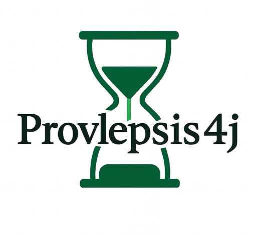
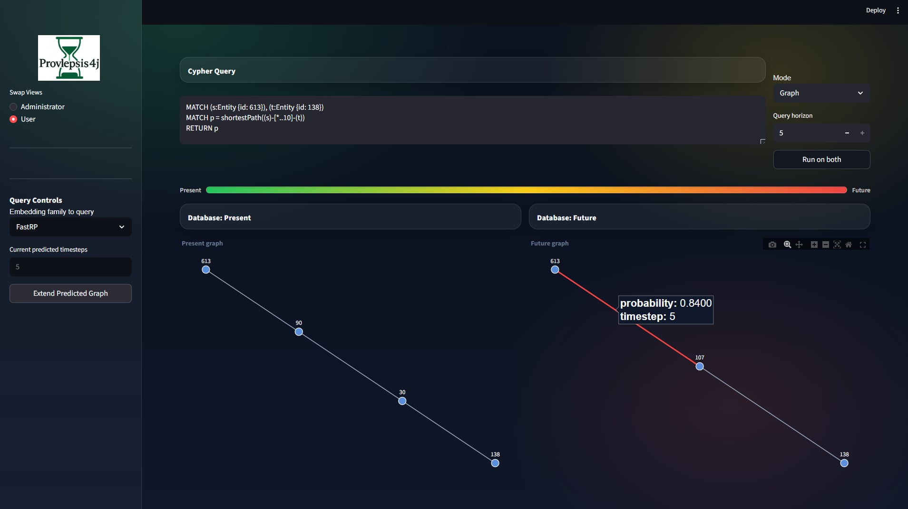
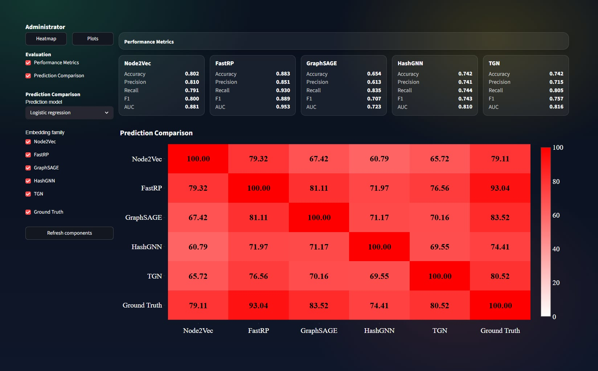
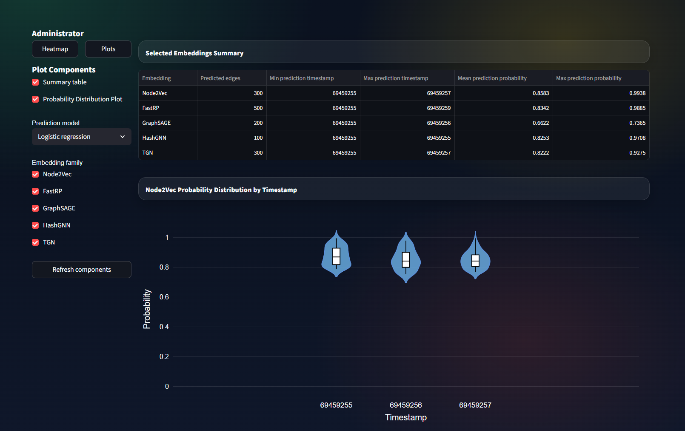
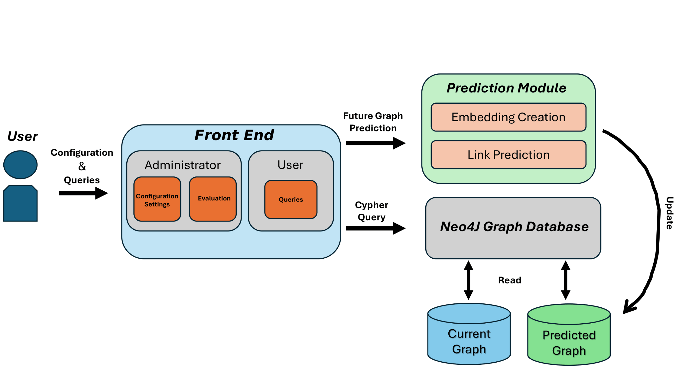

<div align="center">
  

  # Provlepsis4j

  **Query both the current graph and a predicted future graph in Neo4j using the same Cypher queries.**  
  Compare results **side by side** and **repeat prediction rounds** to extend the predicted graph further into the future.

  <!-- <a href="paper/Provlepsis4j_EDBT_demo.pdf">Demo paper (PDF)</a> · -->
  <a href="#quickstart">Quickstart</a> ·
  <a href="#workflow">Workflow</a> ·
  <a href="#cypher-examples">Cypher examples</a>

  
  
  
  
  
  
  [](https://doi.org/10.5281/zenodo.19368266)


</div>

---

## What is Provlepsis4j?

Provlepsis4j is a web system that enables querying both the **current** graph and a **predicted future** graph in Neo4j using the same Cypher queries.

Graph databases such as Neo4j typically query only the current graph, while link-prediction pipelines are executed as separate workflows that output lists of candidate edges. This makes it difficult to combine prediction and querying, and to compare current and predicted graph states within the same environment.

Provlepsis4j addresses this by connecting to a Neo4j instance and maintaining current and predicted graph states through two supported storage representations:

- **Separate databases**: the current graph is stored in the observed Neo4j database, while each predicted future timeline is materialized as a separate predicted Neo4j database with the same node set plus predicted relationships.
- **Single database**: observed and predicted relationships coexist in one Neo4j database, with predicted relationships stored as separate relationship timelines annotated by prediction family, prediction model, probability, and prediction timestep.

Provlepsis4j executes each Cypher query on the current graph state and on the selected predicted future timeline so differences are explicit. Users can also extend the predicted future graph over multiple rounds and inspect how answers change as predicted edges are added.


<p align="center">
  
</p>

### Two views

- **Administrator view**: configure Neo4j, load datasets, split train/validation/test, choose the storage representation, run embedding and prediction configurations, report evaluation metrics, compare prediction sets across configurations, and inspect probability distributions over future timesteps.
- **User view**: write a Cypher query once and see answers on the current graph and the selected predicted future timeline side by side (table + interactive visualization). Predicted edges are annotated by prediction round/timestep, and hovering over them shows their probability and timestamp. The user can also select a query horizon to control how many predicted timesteps are visible.

<p align="center">
  
</p>

The administrator view also includes a **Plots** subview for inspecting prediction behavior after a prediction run. It summarizes the selected embedding families, the number of predicted edges, their prediction-timestamp range, and the mean and maximum prediction probabilities. The violin plots show how the prediction probabilities are distributed at each future timestep, so the administrator can inspect how prediction confidence changes across rounds.

<p align="center">
  
</p>

---

## System overview

<p align="center">
  
</p>

At a high level:

1. **Storage**: Provlepsis4j uses Neo4j as the backend and supports two storage representations:
   - **Separate databases**, where each prediction timeline is stored as a separate Neo4j database.
   - **Single database**, where observed and predicted relationships are stored in the same Neo4j database as separate relationship timelines.

2. **Prediction module** (configurable):
   - selects an **embedding family** such as Node2Vec, FastRP, GraphSAGE, HashGNN, or TGN,
   - selects a **prediction model** such as logistic regression, LASSO regression, or direct TGN,
   - for regression-based configurations, forms **edge-level features** from endpoint embeddings using the **Hadamard product**,
   - trains a model to estimate edge-existence probability,
   - materializes up to `k` predicted edges whose probability is at least `threshold`, storing the edge probability and a discrete prediction timestep.

3. **Querying**: the interface executes the same Cypher query on the current graph and on the selected predicted future timeline. Results are presented side by side.

4. **Multiple future timesteps**: repeating prediction rounds adds new predicted edges with updated prediction timestep metadata, extending the predicted graph further into the future.

---

## Quickstart

### Prerequisites (Neo4j)

You need a Neo4j instance that Provlepsis4j can connect to and use for current and predicted graph states.

**Required:**
- **Python 3.11+**
- **Neo4j 5.x**
- **Graph Data Science (GDS)** plugin
- **APOC** plugin
- A Neo4j user with sufficient privileges to run procedures and write graph data
- Database-creation privileges if you use the **Separate databases** storage representation

The default `requirements.txt` also installs **PyTorch** and **PyTorch Geometric**, which are needed for TGN-related configurations.

### Install dependencies

```bash
pip install -r requirements.txt
```

### Run the interface

```bash
streamlit run app.py
```

### Optional: run the FastAPI backend separately

```bash
uvicorn provlepsis_core.main_fastapi:app --reload --port 8080
```

Then, in the UI:
1. Open **Configuration** and set your Neo4j connection (URI / user / password / database).
2. Load a dataset (CSV edge list + optional node features) or connect to an existing Neo4j database.
3. Create the train/validation/test split.
4. Compute embeddings, run prediction, and start querying (current vs predicted).

---

## Workflow

Provlepsis4j supports querying both the **current** graph and a **predicted future** graph state in Neo4j. Starting from the current graph, the system generates predicted edges using a configurable prediction pipeline and materializes them according to the selected storage representation. In separate-database mode, each prediction timeline is stored as a separate Neo4j database. In single-database mode, observed and predicted relationships coexist in the same database as separate relationship timelines. Users can then issue the same Cypher query on the current graph and on the selected predicted future timeline and inspect how the answers change when predicted edges are included. The process can be repeated over multiple rounds, producing predicted graph states that extend further into the future.

This is the workflow the demo is designed around: **predict → query → compare → iterate**.

### 1) Configure Neo4j

Provlepsis4j runs on top of a Neo4j instance:

- In the **Configuration** panel, set the connection details (URI, credentials, database) so the backend can execute Cypher and GDS procedures on your Neo4j deployment.

### 2) Load a graph

Neo4j serves as the storage backend for both the current and predicted future graph states:

- Through the Provlepsis4j interface, users can **import a dataset from CSV files** to create the current graph, or work with an existing Neo4j database.
- The edges CSV must contain either `source,target` or `src,dst` columns.
- Once the data are imported, the resulting Neo4j database is considered the **current graph** and acts as input to the prediction module.

### 3) Split into train / validation / test

Provlepsis4j splits the graph into training and evaluation data:

- The administrator specifies the **validation** and **test** ratios in the **Split Graph** panel.
- When applicable, the system also supports **temporal splitting**.
- Provlepsis4j uses these ratios to create the splits that are used for training and evaluation in downstream steps.

### 4) Compute embeddings

Provlepsis4j supports several embedding families:

- **Attribute-agnostic** methods, such as **Node2Vec**.
- **Attribute-aware** methods, such as **FastRP**, **GraphSAGE**, and **HashGNN**, which can incorporate node attributes when generating embeddings.
- **Temporal** methods, such as **TGN**, for evolving graphs.

The administrator selects both an **embedding family** and a **prediction model**. For logistic-regression and LASSO-regression configurations, the selected embeddings are used to construct edge-level features for link prediction. The direct TGN prediction model is available only with the TGN family.

### 5) Run link prediction and materialize a predicted future timeline

Provlepsis4j runs a configurable prediction pipeline and materializes the resulting future graph state in Neo4j:

- It constructs **edge-level features** from node embeddings using the **Hadamard product** and trains either **logistic regression** or **LASSO regression** to estimate, for each candidate edge, the probability that it will exist.
- A direct **TGN** prediction model is also available for the TGN family.
- **Observed relationships** in the current graph act as **positive** examples, and randomly sampled nonedges act as **negative** examples.
- The administrator configures the **Number of Predicted Edges** (`k`) and the **Edge Existence Probability Threshold** (`threshold`).
- For inference, the system scores candidate nonedges, orders them by predicted probability, and writes to the selected predicted timeline up to `k` edges whose probability is at least `threshold`.
- For each predicted edge, Provlepsis4j stores the estimated **probability**, the **prediction model**, the **embedding family**, and a discrete **prediction timestep**.

Each prediction timeline is identified by its embedding family and prediction model. In separate-database mode, timelines use database names such as `<base>-node2vec-logistic`, `<base>-fastrp-lasso`, `<base>-graphsage-logistic`, `<base>-hashgnn-lasso`, and `<base>-tgn-tgn`. In single-database mode, the same family/model combinations are stored as independent relationship timelines in the same Neo4j database.

### 6) Query current vs predicted

Provlepsis4j supports querying both the current graph and the selected predicted future timeline using the same Cypher query:

- In the **User** view, the user writes a Cypher query once and selects the embedding family to inspect.
- The prediction model and extension settings come from the latest persisted Administrator configuration.
- The **Query horizon** controls how many predicted timesteps are visible in the selected future timeline.
- Provlepsis4j executes the query on both the **current** graph and the selected family/model future timeline and presents the results side by side.
- Query results can be inspected both as **tables** and as **interactive graph visualizations**.

### 7) Iterate prediction rounds (optional)

Provlepsis4j supports multiple prediction rounds to extend the predicted future graph over several timesteps. In each round, the system repeats the prediction pipeline on the selected future timeline:

- It updates the training/evaluation split for the current prediction round.
- It recomputes or reuses model state depending on the **Predicted edge inclusion** setting.
- It predicts additional edges while avoiding edges already predicted by the same embedding-family/model timeline.
- It inserts the new predicted edges with an updated `predicted_timestep` while leaving other timelines unchanged.

The **Predicted edge inclusion** option controls whether previously predicted edges from the same timeline are included when extending the future graph. When enabled, the prediction process retrains using the extended predicted graph state. When disabled, the system reuses the initial learned state for later prediction rounds.

---

## Cypher examples

Paste these in the **User** view to compare answers on the current graph and the selected predicted future timeline. Use the **Query horizon** control in the interface to choose how many predicted timesteps are visible.

### Neighborhood expansion

```cypher
MATCH (u:Entity {id: "1"})-[r]-(v:Entity)
RETURN u, r, v
LIMIT 50
```

### Shortest path (often changes with predicted edges)

```cypher
MATCH (s:Entity {id: "1"}), (t:Entity {id: "10"})
MATCH p = shortestPath((s)-[*..10]-(t))
RETURN p
```

### Common neighbors

```cypher
MATCH (a:Entity {id: "1"})--(x:Entity)--(b:Entity {id: "10"})
RETURN x, count(*) AS c
ORDER BY c DESC
LIMIT 25
```

---


## Repository layout

```text
.
├── app.py                                  # Streamlit interface
├── README.md
├── Provlepsis4j.png                       # app icon / logo
├── assets/                                # README figures and screenshots
├── provlepsis_core/                       # backend logic
│   ├── admin_extension_config.py          # persisted administrator settings
│   ├── db.py                              # Neo4j connection utilities
│   ├── lp_model_state.py                  # saved model-state utilities
│   ├── main_fastapi.py                    # optional FastAPI entry point
│   ├── pipeline_stats.py                  # prediction/runtime statistics
│   ├── prediction_artifacts.py            # prediction artifacts and score storage
│   ├── prediction_timeline.py             # embedding-family/model timeline naming
│   ├── storage_repr.py                    # storage representation utilities
│   ├── tgn_adapter.py                     # TGN integration utilities
│   ├── routers/                           # API logic for loading, splitting, embeddings, LP, querying
│   │   ├── config.py
│   │   ├── databases.py
│   │   ├── load_graph.py
│   │   ├── split.py
│   │   ├── emb_node2vec.py
│   │   ├── emb_fastrp.py
│   │   ├── emb_graphsage.py
│   │   ├── emb_hashgnn.py
│   │   ├── emb_tgn.py
│   │   ├── lp.py
│   │   ├── lp_iter.py
│   │   ├── tgn_direct.py
│   │   └── query.py
│   └── tgn/                               # TGN implementation
└── requirements.txt                       # Python dependencies
```

## Troubleshooting

- **Cannot create/use predicted DBs**  
  In separate-database mode, your Neo4j user must have privileges to create and use additional databases. If your deployment does not allow this, use the single-database storage representation.

- **`gds.*` procedures missing**  
  Install/enable the Neo4j **Graph Data Science (GDS)** plugin.

- **`apoc.*` procedures missing**  
  Install/enable the Neo4j **APOC** plugin.

- **TGN is unavailable or fails to import**  
  Check that **PyTorch** and **PyTorch Geometric** are installed correctly in the active Python environment. They are included in the default `requirements.txt`.

- **No predicted edges appear in the User view**  
  Check that prediction has been run for the selected embedding family and prediction model, and that the **Query horizon** is greater than zero.

- **Query works on the current graph but not on the predicted graph**  
  Check that the selected predicted timeline exists and that the selected storage representation, embedding family, prediction model, and query horizon match the prediction run.

---

## Citation

If you use Provlepsis4j, please cite our PVLDB demonstration paper. Page numbers and DOI will be added after the second camera-ready round.

```bibtex
@article{provlepsis4j,
  title     = {Provlepsis4j: Querying Future Graphs in Neo4j},
  author    = {Iliadis, Evangelos and Gkartzios, Christos and Pitoura, Evaggelia},
  journal   = {Proc. VLDB Endow.},
  publisher = {VLDB Endowment},
  volume    = {19},
  number    = {12},
  year      = {2026},
  note      = {Demonstration paper. To appear.}
}
```

---

## Contact

- Evangelos Iliadis — pcs00526@uoi.gr  
- Christos Gkartzios — chgartzios@cs.uoi.gr  
- Evaggelia Pitoura — pitoura@uoi.gr
